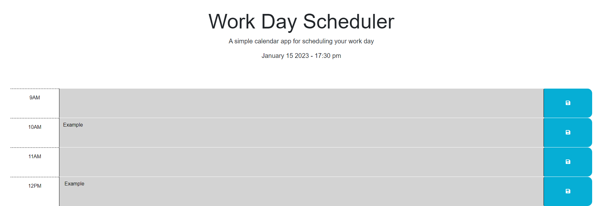

# Work Scheduler
## About
This Work Scheduler utilizes the use of Javascript and  Api`s to call upon data that is stored through the use of 'save buttons' and presenting the saved data which is persistent after the page is refreshed.

Using dayjs and formatting correctly i was able to present the date and time within a function that updates itself every minute.
``` js
// Displays time  below header
  // ============================
  window.onload = titleClock;
  function titleClock() {
    var timeTitle = document.querySelector("#currentDay");
    timeTitle.innerText = dayjs().format("MMMM D YYYY - HH:mm a");
    setInterval(titleClock, 60000);
  }
```

# Usage
Once the user has typed something into the text area, once the save button is click the data is then stored in localStorage, being called upon as the page loads/refreshes gives the user the ability to keep track of tasks ahead and also in the past. 
``` js
// Calls the saved user input and replaces the contents in the
  //  respective containers they were written in.
  var textInput = document.querySelectorAll(".description");
  for (var i = 0; i < textInput.length; i++) {
    var savedText = localStorage.getItem("Key" + i);
    if (savedText) {
      textInput[i].value = savedText;
    }
  }
```
# Licence 
MIT Licence - refer to GitHub.

## Links

Live Page - https://zim40.github.io/Work-Scheduler/ 
 
 